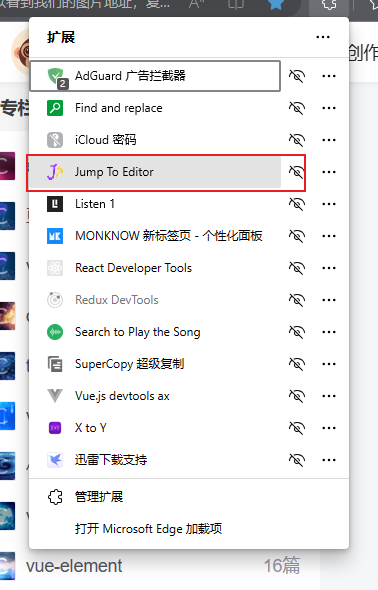
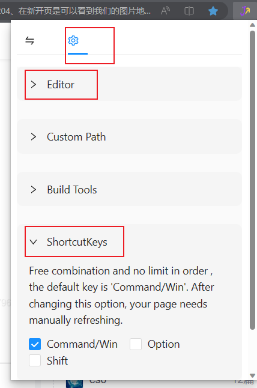

# react-location dev tool


前置：项目为react且使用了 @babel/preset-react-> @babel/plugin-transform-react-jsx-source
## 特性

1. 快速定位页面代码，测试环境切换，控制台install npm包
2. 控制键＋鼠标右键查看当前组件的所有父/子组件列表，点击直接跳转到编辑器
3. 解决了当前页面与 content-script 间的 css 污染问题。
4. 实现开发模式下chrome extension 热更新功能。
5. 使用 react 开发 chrome extension。


## 使用

cmd+click 点击/右键页面react元素，直接跳转vscode代码

支持编辑器/构建工具配置、自定义path




控制台
```
install('lodash')
install.packages
```


开发：
```
yarn start
```
在 chrome 浏览器中加载该应用的 dist 目录，此时 dist 目录下的文件具有热更新功能，并且会自动刷新当前页面。


直接使用：
```
yarn build
```
然后将dist作为插件包安装
